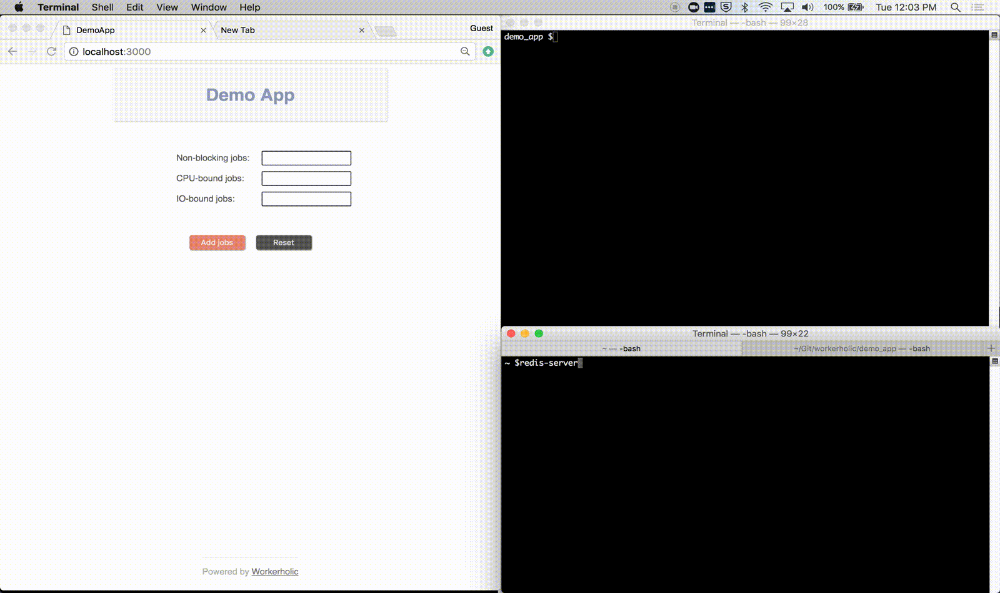

This is the story of how three Software Engineers decided to shed some light on Background Job Processors by building one from scratch.
We started by understanding the use for a Background Job Processor (BJP), then, identifying the most popular ones in the Ruby-ecosystem and, finally, building one from scratch.
In this post we will walk you through the proces of building a BJP from scratch and how we managed to build one, **Workerholic**, that compares to Sidekiq in terms of performance.

But first, let us introduce ouselves:

<ul class="team-names">
  <li class="team-member-name">
    <a href="https://antoineleclercq.github.io">
      <figure>
        
      </figure>
      <strong>Antoine Leclercq</strong>
       
      Software Engineer
    </a>
  </li>
  <li class="team-member-name">
    <a href="http://minevskiy.com/">
      <figure>
        
      </figure>
      <strong>Konstantin Minevskiy</strong>
       
      Software Engineer
    </a>
  </li>
  <li class="team-member-name">
    <a href="https://tim-lee92.github.io/">
      <figure>
        
      </figure>
      <strong>Timmy Lee</strong>
       
      Software Engineer
    </a>
  </li>
</ul>

**We are looking for our next opportunity**, so don't hesitate to **click us to get in touch**!

First, here is a quick demo of **Workerholic in action**:

{:id="demo"}



